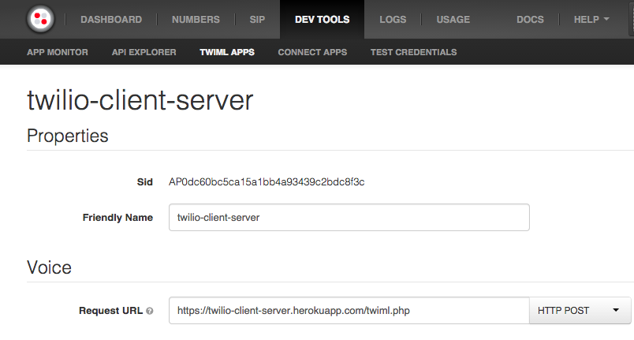

Twilio Client Server
===================

Get all the necessary server-side junk for Twilio Client set up quickly and easily using this simple php server.

Prerequisites
-------------
Make sure you have [created a Twilio account](https://www.twilio.com/try-twilio) and [a TwiML application](https://www.twilio.com/user/account/apps/). You will need your Twilio Account SID & token, as well as your app SID, to deploy this server. After deploying your server, be sure to point your TwiML app's "Voice Request URL" back to twiml.php on your server, like so:

Usage
-----
To deploy using [Heroku](https://heroku.com/), just click here:

Or, if you prefer, you can also test using [ngrok](https://ngrok.com/). Just create an ngrok account & install it, then clone this repo and run `./start.sh any-subdomain-you-want`. The script will take you through the process.

PhoneKit for iOS
----------------

If you're using this server wih an iOS app, check out [PhoneKit](https://github.com/jconst/PhoneKit). It is made specifically to interact with this library to provide useful features that address the most common use cases for the Twilio iOS SDK. 

####WARNING####
Twilio Client Server is just a template aimed at mobile developers who want to get started using Twilio Client without having to worry about setting up a server *right away*. If you put this code (unchanged) on your production server, someone **will** end up using your tokens in their own apps for free Twilio calls, charged to your account. In production, you should always ensure that your capability token server is securely protected.
